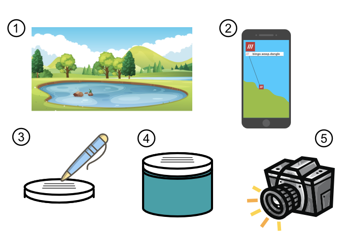
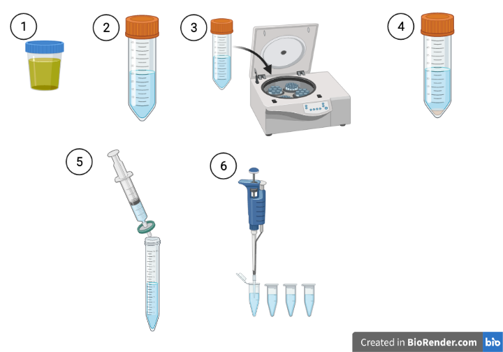
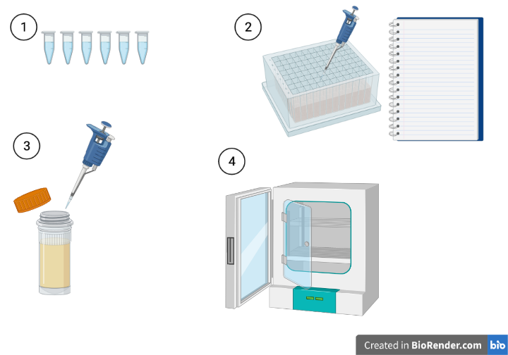

# Phage Enrichment

## Monday 17th May

There will be a 1-hour presentation introducing you to the project. This will be held __at 9:35 am in LSI Seminar Room A__. You will also be provided with a sampling kit containing three jars. The aim is for each student to collect three samples of freshwater. __One__ of these should be from one of the ponds on campus. Try not to all sample the same pond! The other two can be from other sources near your homes or around Exeter. They can include ponds, rivers, bird baths, puddles etc. Each sample will need to be at least 25 mL (each jar holds 40 mL).

At each sample site, 

- [ ] __Step 1__: Find an interesting sampling site
- [ ] __Step 2__: Record the location using the [What3Words](https://what3words.com/) app on your phone.This will be used as the name of the sample. 
- [ ] __Step 3__: Write the three words on the lid of the jar using the waterproof lab pen in your kit, as well as the sample date. 
- [ ] __Step 4__: Fill the jar with water and make sure the lid is tightly fastened. 
- [ ] __Step 5__: Take a photo of the sample site to remind you of what it was you sampled.

When you get home, keep the samples in your fridge overnight. 

Record the details of your sample on the Sample tab on the [Google sheet here](https://docs.google.com/spreadsheets/d/1V6doztAX4AQ5657eH5r0GbJj_GnfMxTe4eKh7metXl0/edit?usp=sharing). Make sure you provide the What3Words address, the date and a brief description of the sample, as well as your name. You do not need to supply a sample number - these will be assigned once all samples are collected.

## Tuesday 18th May

The aim of this session is to prepare your samples for phage hunting. This involves removing solid debris and bacteria by centrifugation and filtering, leaving only the phages (which are smaller than the filter size) in the filtrate. Each sample will be aliquoted into 15 aliquots (one per student).

At the end, you should have three lots of 15 1.5 mL microcentrifuge tubes. These will then be distributed between the students so each student can test each sample on their designated bacterial host.

- [ ] __Step 1__: Bring your samples back to the lab
- [ ] __Step 2__: Transfer each sample to a 50 mL Falcon tube. Fill it up to the 40 mL mark. Samples need to contain the same amount of liquid to ensure balancing in the centrifuge. Label each tube with the sample number and your name. Make sure the lid is securely fastened. Draw an arrow on the lid facing outwards - this will point to where your pellet will be once it has been centrifuged, so you can avoid disturbing it.
- [ ] __Step 3__: Place your sample in the rack at the front of the lab. These will then be centrifuged for 30 mins at 10,000 x g to pellet the solid material and bacterial cells. The phages will remain in the supernatant because they are much smaller.
- [ ] __Step 4__: Retrieve your samples from the rack at the front and carefully carry them to your work area, being careful not to disturb the pellet.
- [ ] __Step 5__: Using a luer-lock syringe, draw up supernatant from one of the samples. Open the syringe filter and lock the syringe into it. Push the syringe down, collecting the filtrate in a fresh tube. You need about 20 mL of filtrate. If the syringe becomes too difficult to push down, it is likely the filter is clogged. To put a new filter on, draw up the syringe slightly so it isn't dripping, then unlock the syringe filter and fit a fresh one.
- [ ] __Step 6__: Using a 1000 µL pipettor, transfer 15 aliquots of 1000 µL of sample into 1.5 mL lo-bind microcentrifuge tube. Label the top of the tube with the sample number and your initials.

Repeat this process for the remaining samples.

When your samples have been aliquoted, take them to the front of the room in the rack. We will then organise them into sample collections for each student.

Place your Falcon tubes in the bucket provided - this allows us to clean them and autoclave them for re-use to save on plastic waste.

Return your sample jars and sampling kit boxes to the front so they can be reused.

## Wednedsay 19th May

The aim of this session is to set up an overnight enrichment of each sample for a pathogen that has been assigned to you. An aliquot of sample is placed into a well in a deep-well plate and mixed with an overnight culture of pathogen and a final concentration of 1 $\times$ LB medium + 10 mM $MgCl_{2}$ + 30 mM $CaCl_{2}$. Any phages in the sample capable of infecting your pathogen will infect it, undergo the lytic cycle and replicate. Over several cycles of lytic infection, the number of phages for your pathogen will be vastly enriched. In this way, we can isolate rare phages from the environment.

To see which pathogen you have been assigned, visit the 'Assigned Pathogens' tab on the [Google Sheet here](https://docs.google.com/spreadsheets/d/1V6doztAX4AQ5657eH5r0GbJj_GnfMxTe4eKh7metXl0/edit?usp=sharing)

- [ ] __Step 1a__: Collect your sample pack from the front. This comprises a 1.5 mL microcentrifuge tube from each sample collected by the students, plus a negative control (autoclaved MilliQ water).
- [ ] __Step 1b__: Label your 96 well plate with your name and the name of the pathogen using labelling tape. This is so we can return your plate to you from the overnight incubation step.
- [ ] __Step 2a__: Work out how many wells you need for your samples, plus the negative control. For each sample you have, aliquot __500 µL__ of 3 $\times$ LB + 30 mM $MgCl_{2}$ + 30 mM $CaCl_{2}$ into a well. Work in rows, e.g. place one sample in A1, the next in A2, then A3 etc. You should end up with about half your plate containing liquid. You don't need to change your pipette tip between wells.
- [ ] __Step 2b__: Change your pipette tip and aliquot __100 µL__ of pathogen culture into each well that contains liquid. Again, you can use one pipette tip for the whole plate here because the content of each well is identical.
- [ ] __Step 2c__: Using a fresh pipette tip __for each well__, Transfer __900 µL__ of one sample into a well that contains medium plus pathogen. Use the pipette to **slowly** mix the well. Record the well with the sample number in your lab books. **This is critical to track back isolated phages to the samples**. 
- [ ] __Step 2d__: Cover the plate with a seal. 
- [ ] __Step 3__: Set up your overnight culture of your pathogen for use tomorrow. To do this, aliquot 10 µL of your culture into a sterilin containing 10 mL of LB medium + 10 mM $MgCl_{2}$ + 10 mM $CaCl_{2}$. Label the sterilin with your name and the name of your pathogen. You can use the short name of the pathogen for this.
- [ ] __Step 4__: Carefully carry the 96-well plate and the sterilin to the front so we can place it in an incubator overnight at 30 °C. with shaking.

### Sewage sample from Countess Wear
Sewage is a rich source of phages that infect pathogenic bacteria. To increase the likelihood of finding phages for our pathogens, we have also prepared a sample of filtered, raw sewage using the same method you used for your samples. Raw sewage can contain harmful pathogens such as Hepatitis, so to minimise risk, we have a pre-prepared deep well plate at the front of the class. Each well in that plate contains 900 µL of centrifuged, filtered sewage and 500 µL of 3 $\times$ LB + 30 mM $MgCl_{2}$ + 30 mM $CaCl_{2}$.

All you need to do is aliquot __100 µL__ of your original pathogen culture into the well designated in the 'Assigned Sewage Plate Well' column in the spreadsheet above. __PLEASE TAKE CARE TO ALIQUOT YOUR PATHOGEN INTO THE CORRECT WELL__. If we end up with two pathogens in the same well, we won't know which one has phages enriched for it.

## Thursday 20th May
* Students transfer 200 µL from each well into a 0.2 µm filter plate atop a regular, sterile 96 well plate.
* Plate is spun at 900 x g for 4 mins to transfer filtrate to bottom plate
* Into a fresh 200 µL 96-well plate, students add 190 µL of LB + 10 mM $MgCl_{2}$ + 10 mM $CaCl_{2}$ per well
* 5 µL of phage lysate from bottom plate is added to each well
* 10 µL of O/N host culture added to each well and plate sealed
* Placed in an incubator O/N at 37 °C.
* Students set up fresh O/N culture of pathogen

### Materials required
* 0.45 µm filter plate (Merck MSHAS4510) (15 total)
* 2 x sterile 200 µL 96-well plate (30 total)
* PCR film (15 total)
* 2 sterilins with 10 mL LB + 10 mM $MgCl_{2}$ + 10 mM $CaCl_{2}$ (30 total)

## Friday 21st May
* Students transfer 200 µL from each well into a 0.2 µm filter plate atop a regular, sterile 96 well plate.
* Plate is spun at 900 x g for 4 mins to transfer filtrate to bottom plate
* Bottom plate is covered with PCR film and stored until Monday at 4 °C.
* Students streak pathogen onto agar plate for growth over weekend.

### Materials required
* 0.45 µm filter plate (15 total)
* 1 x sterile 200 µL 96-well plate (15 total)
* PCR film (15 total)
* 2 x LB agar plates for bacterial growth
* Inoculating loops

