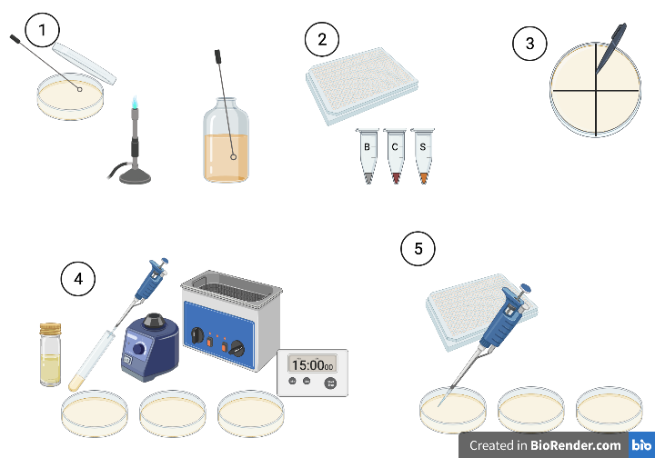
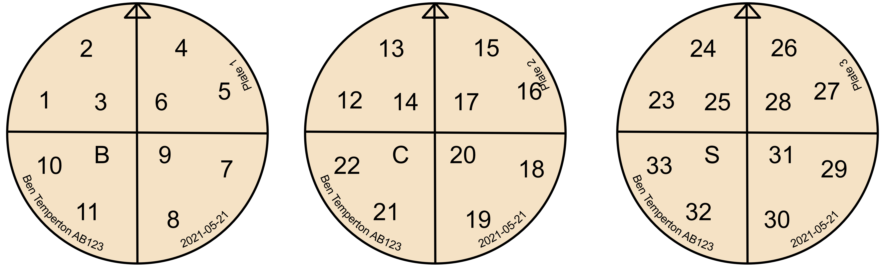
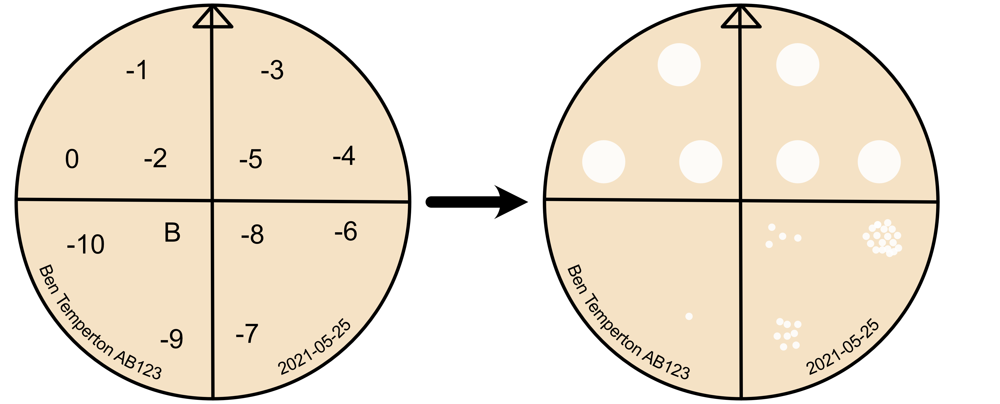
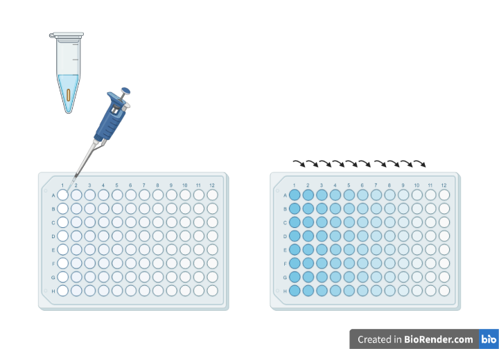
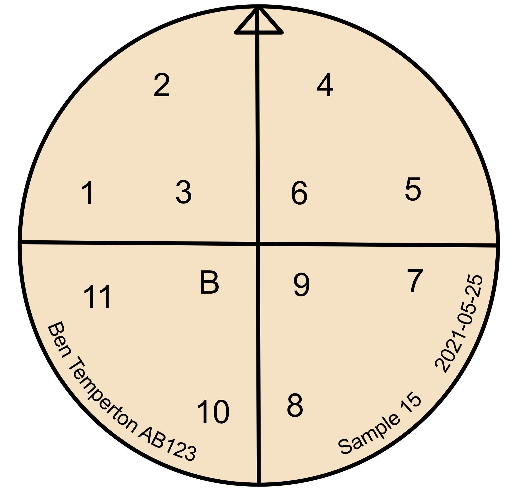

```{r, echo=FALSE}
num_students=11
num_samples=num_students*3
```

# Spot Assays and Purification

Last week, you prepared samples by enriching any phages that might be present for your pathogen. This week, we get to find out if your samples contained any suitable phages. We do this using something called a *spot assay*. Briefly, we add 5 µL of enriched viral lysate to a lawn of host culture. If there are suitable viruses present in the lysate, they will infect the cells in the lawn and start to replicate. Each round of replication releases more viruses, and a plaque begins to form, spreading outwards in a circular fashion from the initial infection. If you're interested in how plaques form, I recommend reading the paper by [@Abedon2009-zt].


## Monday 24th May

Today, we set up the first spot assay to see if we have any viruses in your samples. To make the lawn of bacteria, you need to combine an exponentially growing host with soft agar, then pour it onto a bottom plate and swirl it round for even coverage. You need to work quickly. The molten agar is above the thermal tolerance of most host bacteria, so we need to minimise the time the host spends in hot agar. Once on the bottom plate, the hot agar sets quickly, so you need to swirl quickly to get even coverage before it solidifies.

We've set up three pouring stations with water baths containing glass test tubes with 3 mL molten top agar in them. Students will come up in turn and pour their host lawns. You'll have one extra plate for a practice pour. 




- [ ] __Step 1__: Make a fresh overnight culture for tomorrow's plaque assays. Flame an inoculation loop until it glows red and then allow it to cool. Pick 3-4 colonies from your overnight streak plate by dabbing the loop on them. Transfer the loop into fresh LB medium in a sterilin. Reflame your loop. Label the sterilin with your name, date and host name. Bring the new streak plate and overnight culture to the front for us to incubate.

- [ ] __Step 2__: Collect your plate of phage lysates from last week and a culture of your host at $OD_{600}$ of 0.6. You will also need `r ceiling((num_samples+1)/12) + 1` bottom agar plates. You'll also need to collect a microcentrifuge tube of the phage lysate for your host from the chicken sample (__C__), and a microcentrifuge tube of the phage lysate for your host from the sewage sample (__S__). 
- [ ] __Step 3__: You'll be putting 12 spots per plate (one per sample). I find the easiest way to do this is to divide your plate into quadrants, and then place three spots per quadrant. Draw two perpendicular bisecting lines on the bottom of each plate with a ruler to divide it into quadrants. Mark one edge with an arrow so we can orientate it. Label each plate with your name, the host bacterium, the date, and _Plate 1_ through _Plate `r ceiling((num_samples+1)/12)`_. Label the last plate _Practice_. On your three numbered plates, write the numbers of the samples where you are going to put them in the quadrants as shown here:


where __B__ is where you'll put your blank, __C__ is where you'll put your chicken sample and __S__ is where you'll put your sewage sample.


- [ ] __Step 4a__: Bring your labelled plates and host culture to a pouring station. We'll walk you through the process. Briefly vortex your host culture (1-2 seconds) to resuspend it. Under a blue flame, put your practice plate in front of you and take off the lid. Take the cap off of a tube of molten agar, but leave it in the water bath. Use a pipette to suck up 1 mL of host culture into a blue tip. Using the other hand, take the tube of molten agar out of the bath and add the 1 mL of culture to it. Immediately vortex the agar (1-2 seconds) to mix and pour quickly but smoothly into the centre of the practice plate. If there are any bubbles in the tube, they'll come out last, and you want to leave them in the tube. Quickly place the tube into the waste beaker and swirl the plate to ensure even coverage of the agar across the surface. Put the lid back on the plate, but leave it with the agar on the bottom to allow the top agar to set. Slide the plate over to one side and repeat with your remaining three plates. Note the time or set a timer for 15 minutes.
- [ ] __Step 4b__: After 15 minutes, collect your plates (the top agar should now be set) and take them back to your work area. Spot assays work best if the phages are added shortly after the top agar has set.
- [ ] __Step 5a__: Under a blue flame, open up Plate 1 and spot 5 µL of sample from the first eleven samples of your 96 well plate, plus your blank onto their appropriate locations on the plate. To do this, gently push the liquid out of the pipette over the location, when it has formed a droplet, touch the droplet to the surface of the agar to transfer.
- [ ] __Step 5b__: Cover the plate and gently slide it to one side so as not to disturb the drops (or you get long, streaky plaques). As long as it is still near the blue flame, slide the lids partially to one side to speed up drying. __DO NOT INVERT THE PLATE__. It can take 20-30 mins outside of a flowhood for a droplet to dry, so we want to leave it as long as possible. Once the droplet is dry, any phages will diffuse through the agar and find their prey.
- [ ] __Step 5c__: Repeat the process with the remaining two plates and the remaining samples. As before, if you accidentally put a sample on the wrong spot, make a note of it so we can correct it later.
- [ ] __Step 5d__: When the last plate is dry, slide the lids back on and invert the plates. Bring the plates to the front and we will incubate them at 37 °C overnight to allow plaque formation. Put a PCR film on the 96-well plate of lysate plate and return it to the front (we'll keep it just in case!)


## Tuesday 25th May

It's plaque-picking day! Hopefully, at least one of your samples will have yielded a plaque on one of the hosts we have attempted. With a bit of luck, you are now the discoverer of a new virus (or viruses!). At this stage, there is the possibility that each plaque comprises a mixture of phages. 

If phages for the host are common in the sample, (e.g. *E. coli* phages in sewage), it's quite likely that more than one suitable phage was in the original overnight inoculum. This is where infection efficiency comes into play in enrichment cultures - phages that replicate faster than other phages will produce more progeny. Following the first round of enrichment, the fastest phages will be the most abundant. The second round of enrichment in pure culture provides a second round of purifying selection. So, even if the initial sample had lots of suitable phages, it's reasonably likely that by this stage, your lysate contains only one or two phages.

So, if we are interested in recovering the maximum *diversity* of phages from a sample, then enrichment is not advised, if samples contain lots of different phages. To maximise diversity, the best way is to just do directly spot the original sample on a lawn of bacteria and look for different plaque morphologies. 

For our purposes, we use enrichment for two reasons: First, there are many hosts for which viruses are not common, so we need to amplify them up in order to isolate them. Second, even if a sample contains lots of suitable phages, the ones best suited for phage therapy are those that are the fastest replicating, most virulent phages for that host - i.e. the ones that would be victorious in purifying selection during enrichment.

There is still the risk though that we have multiple fast replicating phages in our lysate. If we were to extract DNA from these now and then sequence them, we run the risk of combining the genomes of two phages. Even if we can assemble them into individual phage genomes, we could end up with a mixture of phages where one is suitable for therapeutic use and the other isn't. So, we need to purify them into an axenic culture. 

We do this through something called 'Dilution to Extinction' purification. Briefly, we take a plaque sample, then use it to make a dilution series. We plate out each dilution in a spot assay until we can see individual plaques. 



We then pick a plaque that is from the greatest amount of dilution (lowest concentration of phages). It is possible that there could still be more than one phage in this plaque, if we were unlucky, so we repeat the process another two times. For the rest of this week, we will be performing these purification steps.

- [ ] __Step 1__: Make a fresh streak plate of your assigned culture. Flame an inoculation loop until it glows red and then allow it to cool. Pick 3-4 colonies from your overnight streak plate by dabbing the loop on them. Streak them down one side of a petri dish containing LB + agar. Reflame your loop, allow to cool and drag one side perpendicular to the original streak. Turn your plate 90° and repeat. Label with your name, date and host name.

- [ ] __Step 2__: Make a fresh overnight culture for tomorrow's plaque assays. Flame an inoculation loop until it glows red and then allow it to cool. Pick 3-4 colonies from your overnight streak plate by dabbing the loop on them. Transfer the loop into fresh LB medium in a sterilin. Reflame your loop. Label the sterilin with your name, date and host name. Bring the new streak plate and overnight culture to the front for us to incubate.

- [ ] __Step 3__: Collect your plates from the front and note the samples for which you have plaques. Make a record of the features of the plaque (We'll take photos of each plate with plaques).
* *How big is it?* Plaque size is a function of how easily the virus diffuses through the medium (e.g. size) and how fast it replicates - plaques stop growing when the hosts reach stationary phase in the medium. The faster it replicates, the greater the number of replication cycles, the larger the plaque.
* *Does it have a halo?* A halo is a good indicator of a virulent phage with an explosive escape from the cell powered by lysins. Lysins continue to diffuse through the medium and kill hosts after the viral plaque has stopped growing, creating a halo. 
* *Is the centre clear or cloudy?* Cloudy plaques are usually a good indicator of a temperate phage. Temperate phages confer __superinfection immunity__ to the cell, preventing infection from other similar phages. Protected from lytic infection in this way, the cells can continue to replicate in the plaque, causing it to be cloudy. It doesn't reach the same density as the surrounding lawn because the lytic/lysogenic switch is a stochastic process, so some killing continues.

You have been assigned three phages from your samples on the spreadsheet [here](https://docs.google.com/spreadsheets/d/1V6doztAX4AQ5657eH5r0GbJj_GnfMxTe4eKh7metXl0/edit?usp=sharing)


- [ ] __Step 4a__: Label a microcentrifuge tube containing 100 µL of SM buffer with the phage identifier (e.g. P1), the host and your name.
- [ ] __Step 4b__: Under a blue flame, take the lid off of your plate. Set a 1000 µL pipette to 200 µL. Using a blue pipette tip take a core of the plaque (we'll show you how to do this) and eject the agar core into the 100 µL of SM buffer. Vortex the microcentrifuge tube for 2-3 seconds, leave for 5 minutes then vortex again for 2-3 seconds. The viruses will be released from the agar into the SM buffer.




- [ ] __Step 5a__: Into a 96 well plate, set up a dilution series in a row for each plaque you have picked. Pipette __90 µL__ of SM buffer into wells 2 through 11 (ignore columns 1 and 12). You can use the same pipette tip for each row.
- [ ] __Step 5b__: Pipette __100 µL__ from your microcentrifuge tube into column 1.
- [ ] __Step 5c__: Pipette __10 µL__ from column 1 into column 2 and mix with gentle pipetting.
- [ ] __Step 5d__: Pipette __10 µL__ from column 2 into column 3 and mix with gentle pipetting.
- [ ] __Step 5e__: Pipette __10 µL__ from column 3 into column 4 and mix with gentle pipetting.
- [ ] __Step 5f__: Repeat this process of adding __10 µL__ of mixture from column $n$ into $n+1$ and mixing until you've added 10 µL to column 11 and mixed.
- [ ] __Step 5g__: Change your pipette tip and do this each microcentrifuge tube you have, with each going into column 1 on a different row. 

- [ ] __Step 6a__: Collect a bottom agar plate for every row you have filled on your 96-well plate.
- [ ] __Step 6b__: Divide it into quadrants and mark the locations of the dilution series as shown in the figure below.



The numbers correspond to the columns of the plate. To convert to dilution factor, we subtract 1 and raise it to the power of 10, e.g. Position 1 is undiluted ($10^{0}$), Position 2 is a 10-fold dilution ($10^{1}$) etc. Label the plate with your name, the host name, the date and the sample number from which the plaque was picked.

- [ ] __Step 7__: Using the same protocol as yesterday, visit a pouring station and make a lawn of bacteria on your plates and allow to set for 15 mins before taking them back to your bench.
- [ ] __Step 8__: Using the same method as yesterday, spot __5 µL__ from each well in a row of your 96-well plate onto their assigned position on the plate. Onto the blank (__B__), pipette __5 µL__ of SM buffer. We want to make sure any 'plaque' is a result of viral infection, not an interaction with the buffer. Allow the spots to dry before inverting your plate and bringing it to the front for us to put in an incubator overnight.


## Wednesday 26th May

Hopefully, following overnight culture, your plates will look something like this:


The next step is to core an individual plaque from the largest dilution number (e.g at $10^{-9}$ here) and repeat the dilution to extinction process.

- [ ] __Step 1__: Make a fresh overnight culture for tomorrow's plaque assays. Flame an inoculation loop until it glows red and then allow it to cool. Pick 3-4 colonies from your overnight streak plate by dabbing the loop on them. Transfer the loop into fresh LB medium in a sterilin. Reflame your loop. Label the sterilin with your name, date and host name. Bring the new streak plate and overnight culture to the front for us to incubate.

- [ ] __Step 2__: Label a microcentrifuge tube containing __100 µL__ of SM buffer with the number of the sample, the host and your name for each plate from yesterday.
- [ ] __Step 3__: Under a blue flame, take the lid off of your plate. Take a core of an individual plaque from the largest dilution number. _If you have clearly distinct plaque morphologies at high dilutions, it could be an opportunity to isolate another phage, so let us know!_
- [ ] __Step 4__: Add the core to the 100 µL of SM buffer, vortex, let sit and vortex again as you did yesterday.
- [ ] __Step 5__: Set up your dilution series on a 96-well plate as you did yesterday.
- [ ] __Step 6__: Collect your bottom agar plates and label them up as you did yesterday (date, sample, name, host, plus dilution well in quadrants).
- [ ] __Step 7__: Prepare your bacterial lawns at a pouring station.
- [ ] __Step 8__: Under a blue flame, spot __5 µL__ of each dilution onto the freshly set lawn in the appropriate position and allow to dry. 


## Thursday 27th May
Final Round! Today we repeat what we did yesterday for the final round of purification. At the end of this, plaques are virtually certain to be axenic.

## Friday 28th May
We should now have plaques that are single axenic viral cultures. Now we need to bulk them up for sequencing and imaging and for making viral stocks for future use.


* Students will take a photo of their plates to record plaque morphology. These will also be used to determine approximate PFU counts.
* Students will pick plaque from the biggest dilution (fewest phages) and add it to 50 mL of LB + 10 mM $MgCl_{2}$ + 10 mM $CaCl_{2}$, amended with 1 mL of O/N host culture.
* Cultures will be grown O/N at 30 °C

The next day (Saturday), BT and team will go in and centrifuge the samples down and prepare for each phage 1 x 50 mL tubes of lysate, filtered through a 0.2 µm syringe filter. We will prepare 3 x 2 mL phage stocks in acid washed, autoclaved amber glass vials.

**200 µL of each phage filtrate will be provided to the imaging centre.**

### Materials required
* 3 x 50 mL LB + 10 mM $MgCl_{2}$ + 10 mM $CaCl_{2}$ (2L total)
* 3 x 50 mL falcon tubes (45 total)
* 3 x 0.2 µm syringe filter (45 total)
* 3 x 25 mL syringe with luer lock (45 total).
* 3 x 2 mL amber glass vials
