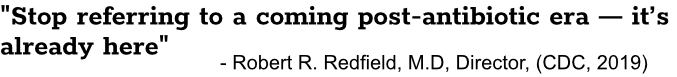

--- 
site: bookdown::bookdown_site
documentclass: book
bibliography: [book.bib, packages.bib]
biblio-style: apalike
link-citations: yes
description: "A handbook."
cover-image: images/logo.v3.png
---

\pagebreak
# Welcome Phage Hunters! {-}

Antimicrobial resistance is a global threat to human health and represents one of the greatest societal challenges of our time. Since their discovery at the turn of the 20th Century, bacteriophages have been used to treat bacterial infections. A contemporary renaissance of phage therapy is underway that offers a powerful tool to complement existing antibiotics and develop the next generation of targeted antimicrobials. 

Phage therapy depends on the availability of a large and diverse library of isolated phages which are able to kill specific pathogenic bacterial strains. While several countries (Israel, USA, Poland, Georgia, S. Korea, France) are building or consolidating such libraries for human use, no such effort is being undertaken in the UK. 

Phages for therapeutic use are typically isolated from a limited range of environments such as sewage and agricultural run-off where pathogen abundance is high, but pathogen diversity is narrow. The enormous diversity of phages in other environments remains a vast and untapped resource of potential therapeutics. 

This is where you come in! During this three week project, you will isolate novel phages against a range of pathogens that cause multi-drug resistant infections. Phages will be isolated from freshwater samples that you collect around campus and the local area. You will purify the phages, extract their DNA for sequencing and then evaluate that sequencing data to determine whether or not a phage is suitable for therapeutic use.

__If a phage is discovered in your samples, you get to name it and be recorded as its Discoverer!__

This project is part of a larger Citizen Phage Library project that we recently started to rapidly develop UK capacity for providing phages for clinical use. If you wish, your phages will be recorded as part of this project. __It would be super-helpful on for the Citizen Phage Library if you would take lots of photos during the workshop!__

## Project Aims {-}

1. To give you all an opportunity to get into the lab and participate in research
2. To isolate phages that can be used for treating multi-drug resistant diseases
3. To be co-authors on a paper highlighting this project as a Course-based Undergraduate Research Experience

## Expected Learning Outcomes {-}

1. Develop understanding of aseptic technique and phage isolation protocols
2. Develop understanding of phage therapy and its potential use in combating antimicrobial resistance
3. Develop bioinformatic skills to annotate and analyse phage genomic information using online tools.

## Your Supervisory Team for this project {-}

* __Ben Temperton__ - Senior Lecturer at Exeter and massive phage nerd.
* __Michelle Michelsen__ - PhD student in the Temperton Lab working on marine host-virus interactions and the influence of infection on cellular metabolism
* __Dr Julie Fletcher__ - Senior Technician in the Temperton Lab working on the Citizen Phage Library Project. Expert in infections associated with diabetic foot ulcers.
* __Dr Sariqa Wagley__ - Postdoctoral fellow with expertise in _Vibrio_ infections in aquaculture.
* __Christian Fitch__ - Undergraduate researcher who will be guiding you through the informatics.
* __Lauren Grant__ - Undergraduate researcher who will be guiding you through the informatics.

